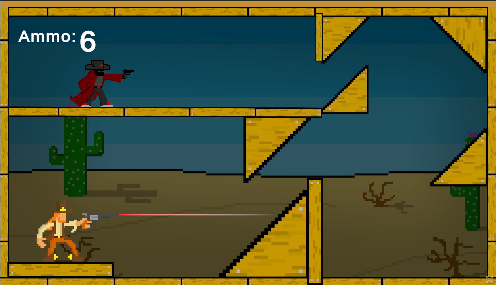

# 4 Days Left - 2D Physics Puzzle Shooter

4 Days Left, Unity ile geliştirilmiş, fizik tabanlı ricochet mekaniğine dayanan 2D puzzle shooter oyunudur. Oyuncular sabit pozisyondan, mermileri duvarlardan ve engellerden sektirerek düşmanları vurmaya çalışır. Sınırlı mermi sayısı ile stratejik düşünce ve fizik hesaplaması gerektiren zorlu bulmacalar sunar.

🎮 **[HEMEN OYNA](https://rigitty.itch.io/4daysleft)** 🎮

## Projenin Amacı

Fizik tabanlı ricochet mekaniği ile klasik puzzle shooter türünde yenilikçi bir oyun deneyimi sunmak hedeflenmiştir. Oyuncular açı hesaplaması, fizik kuralları ve stratejik planlama ile her seviyeyi minimum mermi kullanarak tamamlamaya çalışır.

## Teknik Detaylar

- **Unity**: Oyun geliştirme motoru  
- **C#**: Programlama dili  
- **2D Physics**: Fizik sistemi  
- **Sprite Renderer**: 2D grafik sistemi  
- **Audio System**: Ses ve müzik sistemi  
- **Input System**: Oyuncu kontrolleri  

## Öne Çıkan Özellikler

- � Fizik tabanlı ricochet mekaniği  
- 🔫 Sınırlı mermi sayısı ile puzzle çözme  
- 🏜️ Çöl temalı atmosferik seviyeler  
- � Açı hesaplaması gerektiren gameplay  
- 🧩 Stratejik düşünce bulmacaları  
- 🎨 Pixel art grafik stili  
- 🎵 Atmosferik ses tasarımı  
- ⚡ Hassas fizik motoru  

## Kullanılan Teknolojiler

- Unity 2D Engine  
- C# Scripting  
- Unity Physics 2D  
- Unity Audio System  
- Unity Input System  
- Sprite Animation System  

## Oyun Görüntüleri

### Ana Oynanış

Oyuncu sabit pozisyondan, mermileri doğru açıyla ateşleyerek duvarlardan ve engellerden sektirmeli ve düşmanları vurmalıdır. Sınırlı mermi sayısı (Ammo: 6) ile fizik hesaplaması ve strateji gerektiren puzzle bulmacaları çözülmelidir.

## 🎮 Oyunu Oyna

### 🌐 Web Versiyonu 
**Hemen oynayın**: [https://rigitty.itch.io/4daysleft](https://rigitty.itch.io/4daysleft)

Web tarayıcınızdan direkt olarak oynayabilirsiniz. Herhangi bir indirme gerektirmez!

## Oyun Mekaniği

### 🎮 Kontroller
- **Nişan Alma**: Mouse Movement (açı ayarlama)  
- **Ateş Etme**: Mouse Left Click  

### 🔫 Ricochet Sistemi
- Fizik tabanlı mermi sektirme  
- Duvar açıları ve yansıma hesaplamaları  
- Çoklu sekme ile karmaşık yollar  
- Hassas açı gerektiren puzzle'lar  

### 🏜️ Level Tasarımı
- Çöl temalı platform yapısı  
- Stratejik yerleştirilmiş engellar  
- Kaktüs ve duvarlardan sekme  
- Çok katmanlı bulmaca seviyeleri  

### 🎯 Hedef Sistemi
- Sabit düşman pozisyonları  
- Minimum mermi ile maksimum etki  
- Perfect shot bonus sistemi  
- Challenging angle calculations  

## Proje Yapısı

### 📁 Klasör Organizasyonu
- `Assets/Scripts/`: C# script dosyaları  
- `Assets/Sprites/`: 2D görsel varlıklar  
- `Assets/Audio/`: Ses efektleri ve müzikler  
- `Assets/Scenes/`: Oyun sahneleri  
- `Assets/Prefabs/`: Prefab objeleri  
- `Assets/Materials/`: Materyal dosyaları  

### 🔧 Ana Scriptler
- `PlayerController.cs`: Oyuncu kontrolleri  
- `EnemyAI.cs`: Düşman yapay zekası  
- `WeaponSystem.cs`: Silah ve mermi sistemi  
- `GameManager.cs`: Oyun yönetimi  
- `UIManager.cs`: Kullanıcı arayüzü  
- `AudioManager.cs`: Ses yönetimi  

## Geliştirme Ortamı

- Unity 2022.3 LTS  
- Visual Studio 2022  
- Unity Package Manager  
- Unity Analytics  
- Unity Cloud Build  

## Kurulum ve Çalıştırma

### 🛠️ Geliştirme Kurulumu
1. Unity Hub'ı yükleyin
2. Unity 2022.3 LTS sürümünü yükleyin
3. Projeyi Unity'de açın
4. Play butonuna basarak test edin

## Özellikler ve Mekanikler

### 🎯 Physics-Based Mechanics
- Realistic ricochet calculations  
- Angle-based puzzle solving  
- Strategic resource management  
- Precision aiming requirements  

### 🧩 Puzzle Elements
- Multi-bounce trajectory planning  
- Environmental obstacle utilization  
- Limited ammunition optimization  
- Perfect shot achievement system  

### 🔊 Audio Design
- Atmospheric desert soundscape  
- Dynamic music system  
- Weapon sound effects  
- Environmental audio cues  

## Kurulum

1. Unity Hub'ı yükleyin
2. Unity 2022.3 LTS sürümünü edinin
3. Projeyi clone edin veya download edin
4. Unity'de "Open Project" ile proje klasörünü seçin
5. Play butonuna basarak oyunu test edin

## Build Alma

1. **File > Build Settings** menüsüne gidin
2. Platform olarak **PC, Mac & Linux Standalone** seçin
3. **Target Platform**: Windows
4. **Architecture**: x86_64
5. **Build** butonuna tıklayın
6. Build klasörünü seçin ve bekleyin

## Katkısı Geçenler

- ahsencakir & rigitty